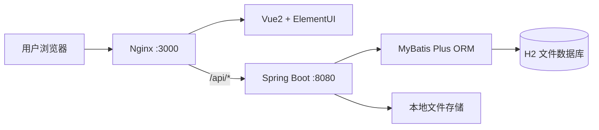
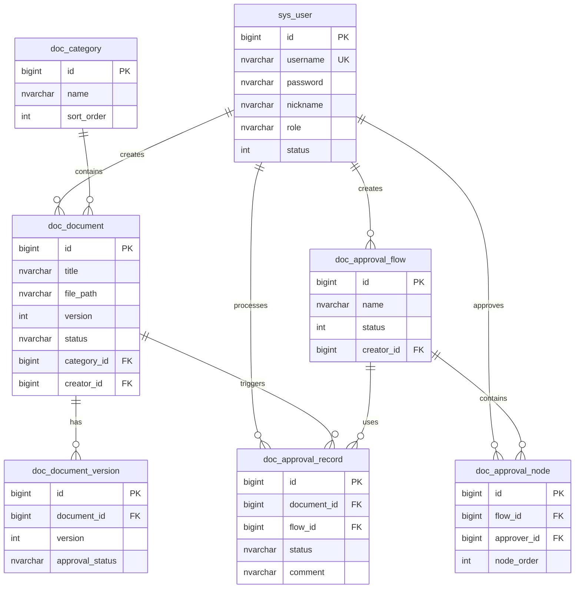

# 🚀 DocFlow — 企业级文档管理系统

> **让文档流转更高效，让审批管理更透明。** 一站式文档全生命周期管理平台，覆盖文档上传、版本控制、审批流程配置与执行等核心场景。

---

## 🏗️ 系统架构



### 核心模块职责

| 模块 | 职责 |
|------|------|
| **认证模块** | JWT 令牌签发、用户注册/登录、权限校验 |
| **文档模块** | 文档 CRUD、文件上传/下载、版本管理 |
| **审批模块** | 审批流程配置、多级审批节点、审批执行与记录 |
| **用户模块** | 用户管理、角色权限控制、个人中心 |
| **分类模块** | 文档分类 CRUD、关联校验 |

---

## 💾 数据库设计



- **数据库类型**: H2 文件数据库
- **连接方式**: 默认使用 `./data/doc_manager`，容器内无需额外数据库服务
- **初始化脚本**: `backend/src/main/resources/schema.sql` 和 `backend/src/main/resources/data.sql`

---

## 🛠 技术栈

| 层级 | 技术 |
|------|------|
| **Frontend** | Vue 2.6 + Element UI 2.15 + Vuex + Vue Router + Axios |
| **Backend** | Spring Boot 2.7 + MyBatis Plus 3.5 + Spring Security + JWT |
| **Database** | H2 |
| **Infra** | Docker + Nginx + Maven |

---

## 🚀 快速启动

### 本地开发

1. 启动后端：
   ```bash
   cd backend
   mvn spring-boot:run
   ```
2. 启动前端：
   ```bash
   cd frontend
   npm install
   npm run serve
   ```
3. 访问前端 `http://localhost:3000`，后端 API 为 `http://localhost:8080/api`。

### Docker 单镜像

外层 `Dockerfile` 是交付启动入口，构建上下文为项目同级目录，代码会复制到容器 `/app`。

1. 构建镜像：
   ```bash
   docker build -t docflow-3498 .
   ```
2. 启动服务：
   ```bash
   docker run --rm -p 3000:80 -p 8000:8080 docflow-3498
   ```
3. 访问前端 `http://localhost:3000`，后端 API 为 `http://localhost:8000/api`。

## 🔗 服务地址

| 服务 | 地址 |
|------|------|
| **前端** | http://localhost:3000 |
| **后端 API** | http://localhost:8000/api |
| **H2 控制台** | http://localhost:8000/h2-console |

## 🧪 测试账号

| 角色 | 用户名 | 密码 |
|------|--------|------|
| 管理员 | admin | 123456 |
| 普通用户 | zhangsan | 123456 |
| 普通用户 | lisi | 123456 |

---

## 📷 核心功能

### 1. 文档管理
- 文档上传、下载、编辑、删除
- 多分类归档，支持按标题/分类/状态筛选
- 完整版本历史记录

### 2. 审批流程
- **可视化流程配置**：自定义多级审批节点与审批人
- **文档更新审批**：上传新版本时可选择审批流程
- **审批处理**：通过/拒绝操作，支持填写审批意见
- **审批流转**：自动流转至下一节点，全部通过后自动发布

### 3. 用户与权限
- 管理员/普通用户双角色体系
- 管理员：用户管理、分类管理、审批流程配置
- 普通用户：文档操作、审批处理
- 安全防护：管理员不可修改自身角色和状态

### 4. 个人中心
- 基本信息编辑（昵称/邮箱/手机号）
- 密码修改（旧密码验证）
- 数据一致性：修改昵称后全局同步

### 5. 工作台仪表盘
- 文档/用户/审批统计概览
- 最近文档快速访问
- 快捷操作入口

---

## 📂 项目结构

```
label-3498/
├── README.md                          # 项目文档
├── backend/                           # Spring Boot 后端
│   ├── settings.xml                   # Maven 阿里云镜像配置
│   ├── pom.xml
│   └── src/main/java/com/docmanager/
│       ├── DocManagerApplication.java # 启动类
│       ├── common/                    # 统一响应封装
│       ├── config/                    # 安全、MyBatis、数据初始化配置
│       ├── controller/                # REST 控制器
│       ├── dto/                       # 数据传输对象
│       ├── entity/                    # 数据库实体
│       ├── exception/                 # 全局异常处理
│       ├── mapper/                    # MyBatis Plus Mapper
│       ├── security/                  # JWT 认证过滤器
│       └── service/                   # 业务逻辑层
└── frontend/                          # Vue2 + Element UI 前端
    ├── nginx.conf                     # Nginx 反向代理配置
    ├── package.json
    └── src/
        ├── api/                       # API 请求封装
        ├── layout/                    # 页面布局框架
        ├── router/                    # 路由与守卫
        ├── store/                     # Vuex 状态管理
        ├── styles/                    # 全局样式
        ├── utils/                     # Axios 拦截器
        └── views/                     # 页面组件
            ├── Login.vue              # 登录页
            ├── Register.vue           # 注册页
            ├── Dashboard.vue          # 工作台
            ├── Profile.vue            # 个人中心
            ├── document/              # 文档管理
            ├── approval/              # 审批管理
            ├── category/              # 分类管理
            └── user/                  # 用户管理
```

---

## 🔧 专业工程实践

### 1. 日志系统
- 使用 SLF4J + Logback 标准日志框架
- 按模块分级记录（INFO/DEBUG/WARN/ERROR）
- 结构化日志输出，包含时间戳、线程、级别、类名

### 2. 错误处理
- 全局异常处理器 `GlobalExceptionHandler` 统一捕获
- 前端 Axios 拦截器消息去重（2秒内相同消息不重复弹出）
- 业务异常标记 `_isBusinessError` 防止重复提示
- 外键约束删除前关联检查，返回友好提示

### 3. 数据校验
- 后端：Spring Validation 注解（`@NotBlank`, `@Size`）
- 前端：Element UI 表单验证规则
- 邮箱/手机号：空值允许提交、填写则校验格式

### 4. 接口设计
- RESTful 风格 API
- 统一响应格式 `{code, message, data}`
- JWT Bearer Token 认证
- RBAC 权限控制（`@PreAuthorize`）

### 5. 生产级特性清单

| 特性 | 状态 |
|------|------|
| Docker 单镜像启动 | ✅ |
| H2 文件数据库持久化 | ✅ |
| 数据库种子数据自动填充 | ✅ |
| 运行时密码初始化（BCrypt 兼容） | ✅ |
| CORS 跨域配置 | ✅ |
| 文件上传/下载 | ✅ |
| 分页查询 | ✅ |
| 路由守卫 & 权限菜单 | ✅ |
| 响应式布局 | ✅ |
| 中文字符支持（无乱码） | ✅ |
| 多阶段 Docker 构建（镜像精简） | ✅ |
| Maven 阿里云镜像加速 | ✅ |
| npm 淘宝镜像加速 | ✅ |

---

## 🐳 运行配置说明

### 单镜像服务

| 服务 | 容器端口 | 本地映射示例 |
|------|----------|--------------|
| 前端 Nginx | 80 | 3000:80 |
| 后端 Spring Boot | 8080 | 8000:8080 |

### 数据与文件
- H2 数据库默认写入 `./data/doc_manager`
- 上传文件默认写入 `uploads`
- 容器内通过环境变量 `FILE_UPLOAD_DIR=/app/uploads` 固定上传目录

### 镜像加速
- Maven 使用 `backend/settings.xml` 中的阿里云镜像
- 前端依赖使用 `package-lock.json` 和 `npm ci` 安装
